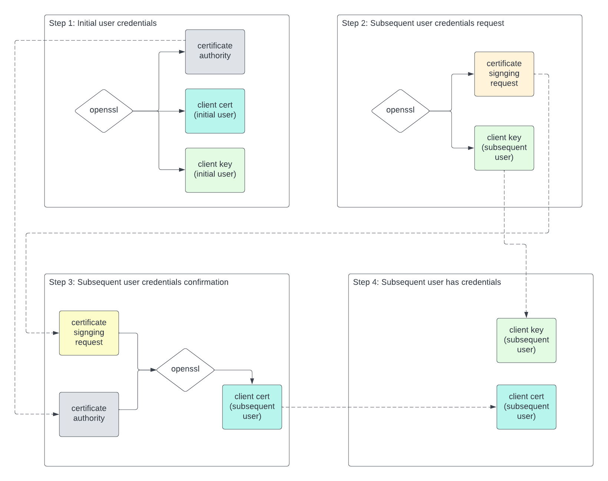

# PKI POC

Test feasibility of PKI workflow for multiple users.

In this example, user with email bob@org.com sets up a system and installs a
CA.  He also creates client cert/key credentials for himself.

Subsequently, user with email sally@org.com requests access to the system by
creating a CSR and corresponding private key.  She sends the CSR to bob@org.com.

Bob confirms access by generating a client cert for sally@org.com using her CSR
and the CA.  He returns the client cert to sally@org.com.  Now she has a cert
and key pair that will provide access to the system.



## Version of openssl

```bash
openssl version
OpenSSL 1.1.1s  1 Nov 2022
```

## Step 1

Performed by user with email bob@org.com when new system instance is created.

Create CA:

```bash
openssl genrsa -out ca.key 4096
openssl req -new -x509 -days 3650 -key ca.key -out ca.crt
```

Create client cert, key signed by CA for user with email bob@org.com:

```bash
openssl genrsa -out bob@org.com.key 4096
openssl req -new -key bob@org.com.key -out bob@org.com.csr
openssl x509 -req -in bob@org.com.csr -CA ca.crt -CAkey ca.key -CAcreateserial -out bob@org.com.crt -days 365
```

Check the validity of the client cert and key:

```bash
./check-pair.sh bob@org.com
```

## Step 2

Performed by user with email sally@org.com who is requesting access to the
system created by bob@org.com.

Create CSR for second user with email sally@org.com:

```
openssl genrsa -out sally@org.com.key 4096
openssl req -new -key sally@org.com.key -out sally@org.com.csr
```

## Step 3

Performed by user with email bob@org.com to confirm access for sally@org.com.

Create signed certificate for sally@org.com:

```bash
openssl x509 -req -in sally@org.com.csr -CA ca.crt -CAkey ca.key -CAcreateserial -out sally@org.com.crt -days 365
```

## Step 4

Check validity of sally@org.com cert and key:

```bash
./check-pair.sh sally@org.com
```

